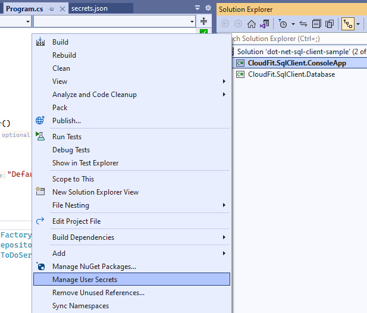
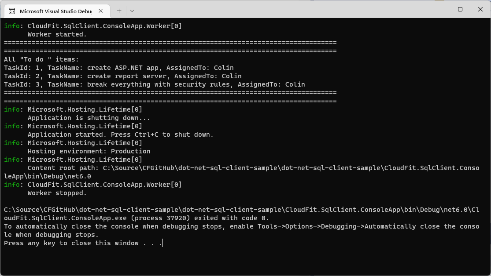
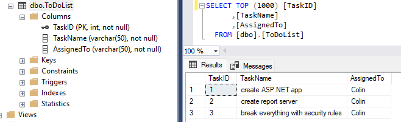

# dot-net-sql-client-sample
SQL Server Client Sample [C#, .NET]

## Opening the Solution
Using *Visual Studio*, please open the `dot-net-sql-client-sample.sln` from the `dot-net-sql-client-sample` folder.

## Setting the connection string
### Local secrets using GUI
In *Visual Studio*, in the Solution Explorer, please right-click on the `CloudFit.SqlClient.ConsoleApp`  project,
and select the `Manage User Secrets` menu item.


This will open the  `secrets.json` file in the editor.

Add the following content to the `secrets.json` file, using your actual database connection string:

```json
{
  "ConnectionStrings": {
    "DefaultConnection": "PLACE_YOUR_CONNECTION_STRING_HERE"
  }
}
```
### Local secrets using CLI
Alternatively, you can execute the following command using CLI,
from the same folder where the `CloudFit.SqlClient.ConsoleApp.csproj` file is located:

```
dotnet user-secrets set "ConnectionStrings:DefaultConnection" "PLACE_YOUR_CONNECTION_STRING_HERE"
```
Local secrets are stored in json files under `%AppData%\Microsoft\UserSecrets`,
you can manipulate `secrets.json` files with the [CLI](https://docs.microsoft.com/en-us/aspnet/core/security/app-secrets) or edit them directly.

## Running the app
Save the `secrets.json` file and run the app, to see return like this:



## Database Table
The database you are connecting to should have `[dbo].[ToDoList]` table structured like this:



Here is a script to create the table:
```sql
/****** Object:  Table [dbo].[ToDoList]    Script Date: 9/15/2022 11:38:47 AM ******/
SET ANSI_NULLS ON
GO
SET QUOTED_IDENTIFIER ON
GO
CREATE TABLE [dbo].[ToDoList](
	[TaskID] [int] NOT NULL,
	[TaskName] [varchar](50) NOT NULL,
	[AssignedTo] [varchar](50) NOT NULL,
PRIMARY KEY CLUSTERED 
(
	[TaskID] ASC
)WITH (STATISTICS_NORECOMPUTE = OFF, IGNORE_DUP_KEY = OFF, OPTIMIZE_FOR_SEQUENTIAL_KEY = OFF) ON [PRIMARY]
) ON [PRIMARY]
GO
INSERT [dbo].[ToDoList] ([TaskID], [TaskName], [AssignedTo]) VALUES (1, N'create ASP.NET app', N'Colin')
GO
INSERT [dbo].[ToDoList] ([TaskID], [TaskName], [AssignedTo]) VALUES (2, N'create report server', N'Colin')
GO
INSERT [dbo].[ToDoList] ([TaskID], [TaskName], [AssignedTo]) VALUES (3, N'break everything with security rules', N'Colin')
GO

```
